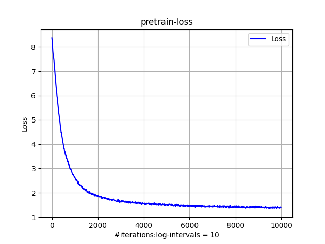
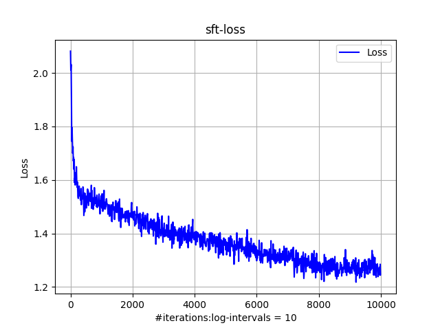

> 参考：
>
> [karpathy/llama2.c](https://github.com/karpathy/llama2.c)
>
> [cindysridykhan/instruct_storyteller_tinyllama2](https://github.com/cindysridykhan/instruct_storyteller_tinyllama2.git)
>
> [jingyaogong/minimind](https://github.com/jingyaogong/minimind)
>

## 环境

```ps
conda create -n llama python=3.10 -y
conda activate llama
pip install -r requirements.txt
```

数据：

```ps
git lfs install
git clone https://huggingface.co/datasets/fhswf/TinyStoriesV2_cleaned
git clone https://huggingface.co/datasets/roneneldan/TinyStoriesInstruct
```

## 运行

根据硬件情况修改一下config里的批量大小、accumulation_steps等超参数和数据位置

```python
data_dir = "/root/autodl-tmp/"

@dataclass
class PretrainConfig:
	# ...
    # batch_size x accumulation_steps x max_seq_len
    # 1024 x 1 x 256 ~200,000
    batch_size: int = 1024
    # ...
```

命令行：

```ps
python tokenizer.py 
python dataset.py --task pretrain
python dataset.py --task sft
python train.py --task pretrain
python train.py --task sft
```

<div style="display: flex;">
  
  
</div>
## 生成效果

>如果要效果卓越，训练数据和超参数还需要更精心设计一些。step也要多一些。这里sft的训练数据instruct格式比较单一，steps也没很多。

预训练：pretrain-results.txt

监督微调：sft-results.txt

## some

**关于RoPE**：以前捋过Transformer[v4.39?]的源码，最初也是按照那个样式写，也知道它对维度的处理和RoPE论文中有些许差异，不影响效果。在尝试把它修正为原论文样式的过程中，我打算使用llama2.c的实现效果作为参照，llama2.c的RoPE之前也有粗略看过，但由于我对相应代码及注释的理解是它用了复数，加上对复数这块忘记得很干净，以前也没深究但又坚信它实现的就是原版。这次debug的过程发现它其实和复数无关，是把d_model按照奇数、偶数位置拆开再合起来：

```python
x = torch.arange(1, 7).reshape(1, 1, 1, 6)
x_r, x_i = x.float().reshape(x.shape[:-1] + (-1, 2)).unbind(-1)
print(f"{x_r.shape}:{x_r}")  # torch.Size([1, 1, 1, 3]):tensor([[[[1., 3., 5.]]]])
print(f"{x_i.shape}:{x_i}") # torch.Size([1, 1, 1, 3]):tensor([[[[2., 4., 6.]]]])
```

RoPE里面的公式：
$$
\boldsymbol{R}_{\Theta, m}^d \boldsymbol{x}=\left(\begin{array}{c}x_1 \\x_2 \\x_3 \\x_4 \\\vdots \\x_{d-1} \\x_d\end{array}\right) \otimes\left(\begin{array}{c}\cos m \theta_1 \\\cos m \theta_1 \\\cos m \theta_2 \\\cos m \theta_2 \\\vdots \\\cos m \theta_{d / 2} \\\cos m \theta_{d / 2}\end{array}\right)+\left(\begin{array}{c}-x_2 \\x_1 \\-x_4 \\x_3 \\\vdots \\-x_d \\x_{d-1}\end{array}\right) \otimes\left(\begin{array}{c}\sin m \theta_1 \\\sin m \theta_1 \\\sin m \theta_2 \\\sin m \theta_2 \\\vdots \\\sin m \theta_{d / 2} \\\sin m \theta_{d / 2}\end{array}\right)
$$
这里认为index从1开始，组对：1-2、3-4、5-6，观察公式可以得到

* 奇数位置（1、3、5）处的结果 = 奇数位置$$\otimes$$cos - 偶数位置$$\otimes$$​​sin

  ```python
  x_out_r = x_r * cos - x_i * sin
  ```

* 偶数位置（2、4、6）处的结果 = 偶数位置$$\otimes$$cos + 奇数位置$$\otimes$$sin

  ```python
  x_out_i = x_r * sin + x_i * cos
  ```

接下来只需要将两者交错：dim所在维度是3，从这一维度开始

```python
x_embed = torch.stack([x_out_r, x_out_i], dim=-1).flatten(3)
"""
tensor([[[[[1., 2.],
           [3., 4.],        -> tensor([[[[1., 2., 3., 4., 5., 6.]]]])
           [5., 6.]]]]])
torch.Size([1, 1, 1, 3, 2]) -> torch.Size([1, 1, 1, 6])
"""
```

**关于tokenizer**：bbpe的训练可以从两个方面着手，一个是huggingface的Trainer和Tokenizer，一个是SentencePiece。之前粗略写过SentencePiece的代码，这次直接整理了一下（其实就是之前照着llama2.c扒的）。如果之后模型训练打算用huggingface的Trainer的话，还是它们的比较方便。在https://github.com/huggingface/transformers/blob/main/src/transformers/convert_slow_tokenizer.py 中有一些SentencePiece转换成HF规格的函数/类，或许也会有帮助；也可以手动实现collate_fn。以及，LlamaTokenizer可以加载SentencePiece训练的模型。

**关于优化器**：我也没想到卡住进度的是优化器，在最初写的那版里，优化器直接使用了权重衰减，没有对层区分，导致loss先下降再上升再下降...现在的代码直接使用了llama2.c里的优化器函数。

```python
# create optim groups. Any parameters that is 2D will be weight decayed, otherwise no.
# i.e. all weight tensors in matmuls + embeddings decay, all biases and layernorms don't.
```

**关于batch_size、accumulation_steps和max_seq_len**：batch_size x accumulation_steps x max_seq_len ~ 100,000

> llama2.c：
>
> 对于中等规模的应用，每次更新的总批次大小（脚本打印为 “每次迭代的词元数将为：”）应在 10 万个词元左右。对于小型应用，该数值可以更低；对于大规模训练（如 GPT/LLama），通常约为 50 万个词元，甚至更多。要达到这个目标，首先将批次大小设置为系统允许的最大值（例如，我最近一次运行时，由于 GPU 内存限制，批次大小为 16），然后根据需要提高梯度累积步数，以达到约 10 万个词元的总批次大小。最后，需要调整学习率（LR）。要在训练允许的范围内尽量提高学习率。非常小的网络可以使用较大的学习率（例如 1e - 3 甚至更高）。大型网络则需要较低的学习率。在大多数中等规模的应用中，3e - 4 是一个比较稳妥的选择，但对于小型网络可能过低，所以可以尝试提高。最后，最大迭代次数决定训练时长。
