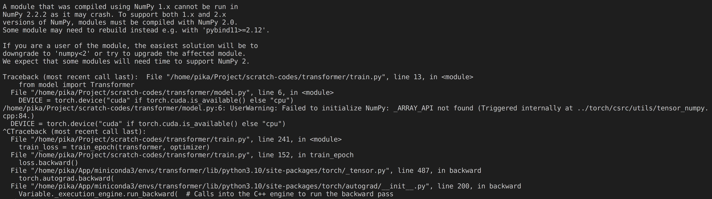

>参考：
>
>https://github.com/pytorch/text/
>
>https://github.com/pytorch/data
>
>https://github.com/pytorch/tutorials/blob/885aa45bb5ca98884b014dd051a898121222d3d0/beginner_source/translation_transformer.py

## 环境

```ps
conda create -n transformer python=3.10 -y
conda activate transformer

pip install -U spacy
pip install portalocker>=2.0.0
pip install torch==2.0.0 torchtext==0.15.1 torchdata==0.6.0
# pip install numpy==1.22.4

python -m spacy download en_core_web_sm
python -m spacy download de_core_news_sm
```
## 运行
修改config.py里的参数/超参数，python train.py

>报错处理：
>
>
>
>pip install numpy==1.22.4

## colab运行（推荐）
将python文件放在Google Drive中，在Google Colab中新建笔记本。安装需要的环境：
```python
!pip install -U spacy
!pip install portalocker>=2.0.0
!pip install torch==2.0.0 torchtext==0.15.1 torchdata==0.6.0

!python -m spacy download en_core_web_sm
!python -m spacy download de_core_news_sm
```
重启会话，挂载Google Drive：
```python
from google.colab import drive
drive.mount('/content/drive')
```
查看torch版本（确定环境依旧在）：
```python
!pip show torch
```
运行：
```python
# 相应的文件在Google Drive /content/drive/MyDrive/ColabNotebooks/transformer-scratch内
!python /content/drive/MyDrive/ColabNotebooks/transformer-scratch/train.py
```
## 模型

### Positional Encoding

$$\text{def EmbedTokenWithPosition}(x_{1:L}:\mathbb{R}^{L\times d_{model}})\rightarrow\mathbb{R}^{L\times d_{model}}$$

- Add in positional information.
- Define positional embeddings:
  - Even dimensions: $$P_{i,2j}=\sin(\frac{i}{10000^{2j/d_{\mathrm{model}}}})$$
  - Odd dimensions: $$P_{i,2j+1}=\cos(\frac{i}{10000^{2j/d_{\mathrm{model}}}})$$
- Return $$[x_1+P_1,\ldots,x_L+P_L]$$

### Attention

#### Scaled Dot-Product Attention

$$\text{def Attention}(q_{1:L_q}:\mathbb{R}^{L_q\times d_k},k_{1:L_k}:\mathbb{R}^{L_k\times d_k},v_{1:L_k}:\mathbb{R}^{L_k\times d_v},mask:\mathbb{R}^{L_q\times L_{k}})\to\mathbb{R}^{L_q\times d_v}$$

- Return $$\text{softmax}(\frac{q·k^T}{\sqrt{d_k}})$$​

#### Multi-Head Attention

$$\text{def MultiHeadedAttention}(q_{1:L_q}:\mathbb{R}^{L_q\times d_{model}},k_{1:L_k}:\mathbb{R}^{L_k\times d_{model}},v_{1:L_k}:\mathbb{R}^{L_k\times d_{model}},mask:\mathbb{R}^{L_q\times L_{k}})\to\mathbb{R}^{L_q\times d_{model}}$$

- Return $$W_{output}\underbrace{\left[\operatorname{Attention}\left(q_{1: L_q}, k_{1:L_k},v_{1:L_v},mask\right), \ldots, \operatorname{Attention}\left(q_{1: L_q}, k_{1:L_k},v_{1:L_v},mask\right)\right]}_{n_{heads}times}$$

### Position-wise Feed-Forward Networks

$$\text{def FeedForward}(x_{1:L}:\mathbb{R}^{L\times d_{model}})\to\mathbb{R}^{L\times d_{model}}{:}$$

- Process each token independently
- For $$i=1,\ldots,L{:}$$
  - Compute $$y_i=W_2\max(W_1x_i+b_1,0)+b_2$$
- Return $$[y_1,\ldots,y_L]$$​

### Add&Norm

$$\text{def LayerNorm}(x_{1:L}:\mathbb{R}^{L\times d_{model}})\to\mathbb{R}^{L\times d_{model}}{:}$$

- Make each $$x_i$$ not too big or small.

$$\text{def AddNorm}(x_{1:L}:\mathbb{R}^{L\times d_{model}},y=f(x_{1:L}):\mathbb{R}^{L\times d_{model}})\to\mathbb{R}^{L\times d_{model}}$$

- Return LayerNorm$$(x_{1:L}+f(x_{1:L}))$$

## some

这是一段陈年老代码，我在整理的时候想添上ref，记得当初是在torch官方的tutorial看到的原版代码，但在现在的tutorial里已经找不到了……去它们的commit里翻了翻，翻了出来……
