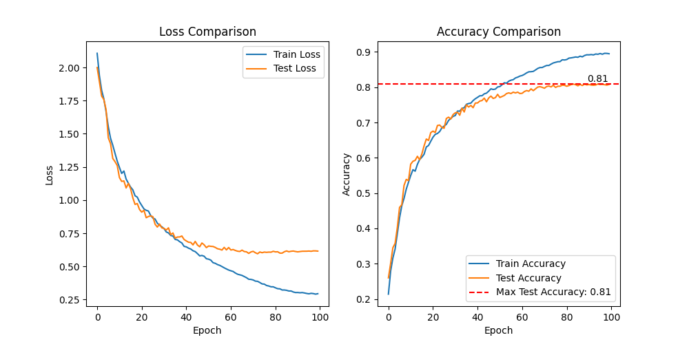

>参考：[tintn/vision-transformer-from-scratch](https://github.com/tintn/vision-transformer-from-scratch.git)

## 环境

```ps
conda create -n vit python=3.10 --y
conda activate vit
pip install torch==2.1 torchvision==0.16 numpy==1.22.4
pip install tqdm
```

## 运行

```ps
python train.py
```



## some

模型方面没什么新东西，只是把文本输入换成了图像，跟着ViT论文那个架构图捋一遍就好。图像分类任务的好处是能计算准确率，这个指标是直接了当的，我理想的测试集准确率是80%，毕竟小模型、小数据、没有预训练。

**关于超参数**：

1. 模型架构
2. 数据增强
3. 学习率，以及学习率调度
4. 正则化：dropout；weight decay；label smoothing
5. 其他

模型架构一般可以“拍脑袋”决定了，基础超参数之间基本都有数值关联，比如`d_ffn`一般会是`d_model`的4倍（当然也可以灵机一动），`d_model`得是`n_heads`的倍数。

数据增强这里“虚晃一枪”的是cifar10的normalize参数，不同图像数据集normalize参数不同，所以都设为0.5是没什么大用的。代码里的其余数据增强也是CV老一套……[hananshafi/vits-for-small-scale-datasets](https://github.com/hananshafi/vits-for-small-scale-datasets.git)中实现很多数据增强方法可以考虑。

学习率大概是关键，至少是达成80%目标的关键了，这里用的是先线性上升再余弦下降，[omihub777/ViT-CIFAR](https://github.com/omihub777/ViT-CIFAR/blob/main/main.py#L81)里的更“智能”。

正则化只使用了dropout。另外使用了梯度裁剪怕训练飞了。